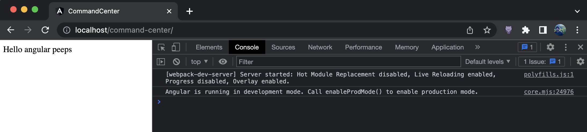

# Angular 15 CLI incorrect websocket URL

## Pre-requisites
- Nodejs LTS
- .NET 7 SDK (brew install --cask dotnet-sdk)

## Run
- cd to `dotnet-based-proxy` and `dotnet run`
  - dotnet CLI might ask you for admin password so it can run on 80 port. You can change the port in `Proxy/Properties/launchSettings.json` if you can't get it to work
- cd to `web-apps` and `npm run start:command-center`
- Navigate to `http://localhost/command-center` and observe console logs
- 

- Now, stop `dotnet-based-proxy`, cd to `nodejs-based-proxy` and execute `npm install` and then `npm start`
  - websocket calls successfully work now. If you edit `web-apps/projects/command-center/src/app/app.component.html`, the page should auto-reload and show new changes
- 
  

